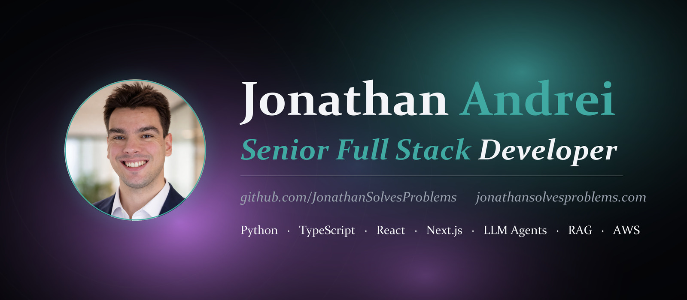
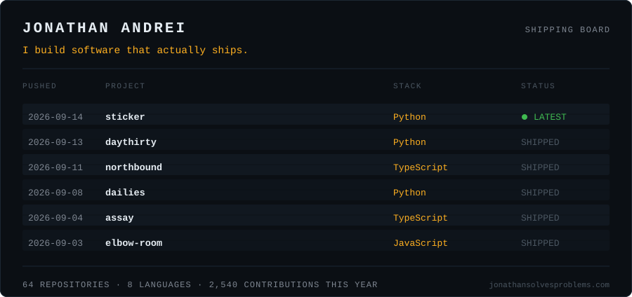

<!-- SHIPATON-CTA:START -->
> **I'm looking for a few Android beta testers right now** (through September 2026, for the [RevenueCat Shipaton](https://shipaton.com)).
>
> I'm shipping **Cooldown**, a wishlist that saves you money by making you wait: add something you're tempted to buy, let it cool off, and watch the money you didn't spend add up.
>
> If you have an Android phone and two minutes: sign up (your email stays private) with **[this quick form](https://docs.google.com/forms/d/e/1FAIpQLSc4q3mTpD87RkIusSgHmmZU3uVm0Bphd-SZwB9HQPgxXxsuDw/viewform)**, I'll add you, then opt in to the **[closed test](https://play.google.com/apps/testing/com.jonathanandrei.cooldown)**. Thirty-second **[demo](https://www.youtube.com/watch?v=7eZKhWm5rdU)**. Happy to test yours back.
<!-- SHIPATON-CTA:END -->

I build software that actually ships. Most of what is below started as a deadline and
ended as something that runs, against real data, in front of real users.

I work mostly in TypeScript and Python, lately on AI agents and developer tooling, and I
care more about whether a thing survives contact with real input than about how clean it
looks in a diagram.

I take on project work: AI agents, RAG pipelines, developer tooling, and integrations.
Details and selected work at [**jonathansolvesproblems.com**](https://jonathansolvesproblems.com).

<picture>
  <source media="(prefers-color-scheme: dark)" srcset="assets/board-dark.svg">
  <source media="(prefers-color-scheme: light)" srcset="assets/board-light.svg">
  
</picture>

<!-- SHIPPING-LOG:START -->
| Project | What it is | Stack |
| --- | --- | --- |
| **[unsay](https://github.com/JonathanSolvesProblems/unsay)** | Unsay: an AI medication-safety agent that goes back and un-says what it told you. Bitemporal ag… | Python |
| **[assay](https://github.com/JonathanSolvesProblems/assay)** | Know if it's working. Skin measurement with an error bar, built on the YouCam Skin Analysis API. | TypeScript |
| **[coldpath](https://github.com/JonathanSolvesProblems/coldpath)** | Prove whether an Arm binary can actually use the chip's matrix hardware. Static ISA verifier +… | Python |
| **[culprit](https://github.com/JonathanSolvesProblems/culprit)** | A stack trace for model decay. Walks DataHub's end-to-end ML lineage from a degraded production… | Python |
| **[Motion-Capture-Hand](https://github.com/JonathanSolvesProblems/Motion-Capture-Hand)** | Hardware motion-capture hand that drives a rigged 3D hand in Blender in real time. An Arduino r… | C++ |
| **[maternal-guard-prompt-opinion-hackathon](https://github.com/JonathanSolvesProblems/maternal-guard-prompt-opinion-hackathon)** | Winner, Agents Assemble: The Healthcare AI Endgame (4,335 participants). MCP server and clinici… | TypeScript |
<!-- SHIPPING-LOG:END -->

<details>
<summary>How this page keeps itself current</summary>

<br>

The board is not a third-party widget. It is an SVG this repo generates from my own
push history, so it reflects what I actually touched last rather than a static image
I updated once and forgot.

```
scripts/build_profile.py     queries the GitHub API, renders both themes, rewrites the table
scripts/build_banner.py      renders the banner from assets/portrait.png
assets/board-*.svg           dark and light boards, swapped by prefers-color-scheme
.github/workflows/           re-runs the generator every Monday and commits any change
```

Run `python scripts/build_profile.py` to refresh it by hand.

</details>
