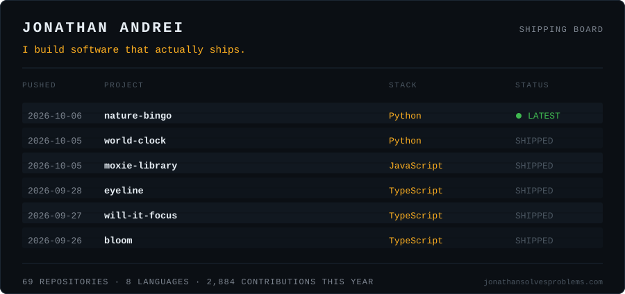

I build software that actually ships. Most of what is below started as a deadline and
ended as something that runs, against real data, in front of real users.

I work mostly in TypeScript and Python, lately on AI agents and developer tooling, and I
care more about whether a thing survives contact with real input than about how clean it
looks in a diagram.

I take on project work: AI agents, RAG pipelines, developer tooling, and integrations.
Details and selected work at [**jonathansolvesproblems.com**](https://jonathansolvesproblems.com).

<picture>
  <source media="(prefers-color-scheme: dark)" srcset="assets/board-dark.svg">
  <source media="(prefers-color-scheme: light)" srcset="assets/board-light.svg">
  
</picture>

<!-- SHIPPING-LOG:START -->
| Project | What it is | Stack |
| --- | --- | --- |
| **[world-clock](https://github.com/JonathanSolvesProblems/world-clock)** | A Kaggle benchmark that asks frontier models what time it is, graded by the IANA time zone data… | Python |
| **[eyeline](https://github.com/JonathanSolvesProblems/eyeline)** | Seated mixed reality previs for VFX shots: block the shot on your table with your hands and lea… | TypeScript |
| **[will-it-focus](https://github.com/JonathanSolvesProblems/will-it-focus)** | An autofocus compatibility agent for cameras, lenses and adapters, built on Sanity Context. Eve… | TypeScript |
| **[bloom](https://github.com/JonathanSolvesProblems/bloom)** | AI client-retention agent for salons: finds clients drifting from their own visit rhythm and dr… | TypeScript |
| **[unsay](https://github.com/JonathanSolvesProblems/unsay)** | Unsay: an AI medication-safety agent that goes back and un-says what it told you. Bitemporal ag… | Python |
| **[sticker](https://github.com/JonathanSolvesProblems/sticker)** | Calls licensed pharmacies to find what a prescription actually costs in cash, and prices every… | Python |
<!-- SHIPPING-LOG:END -->

<details>
<summary>How this page keeps itself current</summary>

<br>

The board is not a third-party widget. It is an SVG this repo generates from my own
push history, so it reflects what I actually touched last rather than a static image
I updated once and forgot.

```
scripts/build_profile.py     queries the GitHub API, renders both themes, rewrites the table
scripts/build_banner.py      renders the banner from assets/portrait.png
assets/board-*.svg           dark and light boards, swapped by prefers-color-scheme
.github/workflows/           re-runs the generator every Monday and commits any change
```

Run `python scripts/build_profile.py` to refresh it by hand.

</details>
